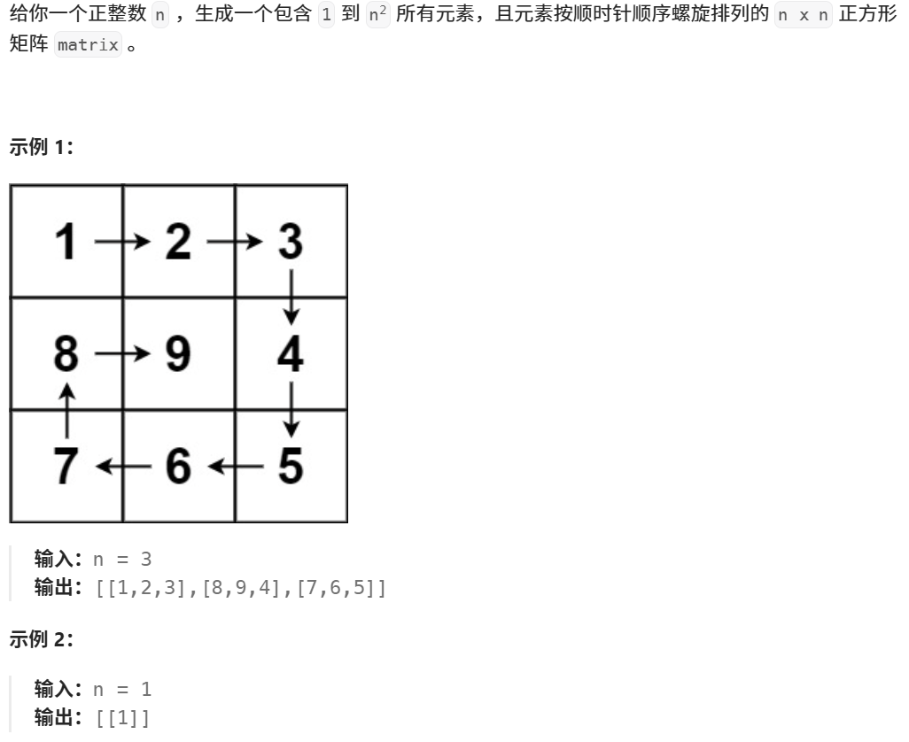

## 螺旋数组




```c++
class Solution {
public:
    vector<vector<int>> generateMatrix(int n) {
        vector<vector<int>> a(n, vector<int>(n)); 
         int i=0;
         int j=0; //表示当前走到哪里了
         int s_x=0;
         int s_y=0;//表示每一圈的起始点
         int offset=1;//表示每一圈减少的一次减1就往里面一圈
         int num=1;//表示每次往里面放的数
         int loop=n/2;
         while(loop--)//注意每次循环保持左闭右开
         {

            i=s_x;
            j=s_y;//如果在这不给两个元素赋值那么初始的y位置是错的直到开始遍历右边的时候y才能正确赋值
            //上边
            for(j=s_x;j<n-offset;j++)
            {
                a[i][j]=num++;
            }
            //右边
            for(i=s_y;i<n-offset;i++)
            {
                a[i][j]=num++;
            }
            //下边
            for(j;j>s_y;j--)
            {
                a[i][j]=num++;
            }
            //左边
            for(i;i>s_x;i--)
            {
                a[i][j]=num++;
            }
            offset++;
            s_x++;
            s_y++;
         }
        if(n%2!=0)
        {
            a[s_x][s_y]=num;
        }
        return a;
    }
};
```

## 区间和

```c++
#include<iostream>
using namespace std;
#include<vector>
int main()
{
    int n;
    cin>>n;
    vector<int>a;
    for(int i=0;i<n;i++)
    {
        int s;
        cin>>s;
        a.push_back(s);
    }
    int s,e;
    while(cin>>s>>e)
    {
    int nums=0;
    for(int i=s;i<=e;i++)
    {
        nums+=a[i];
    }
    cout<<nums<<endl;
    }
    
}
```

看到这个题的第一反应就是秒了，结果写出来之后循环太多了，超时后来稍微想了一下写出了优化解法

```c++
#include<iostream>
using namespace std;
#include<vector>
int main()
{
    int n;
    cin>>n;
    vector<int>b;
    int nums=0;
    for(int i=0;i<n;i++)
    {
        int s;
        cin>>s;
        nums+=s;
        b.push_back(nums);
        
    }
    int s,e;
    while(cin>>s>>e)
    {
        if(s!=0)
        {
        cout<<b[e]-b[s-1]<<endl;
        }
        else
        {
        cout<<b[e]<<endl;
         }
    
    }
    
}
```

